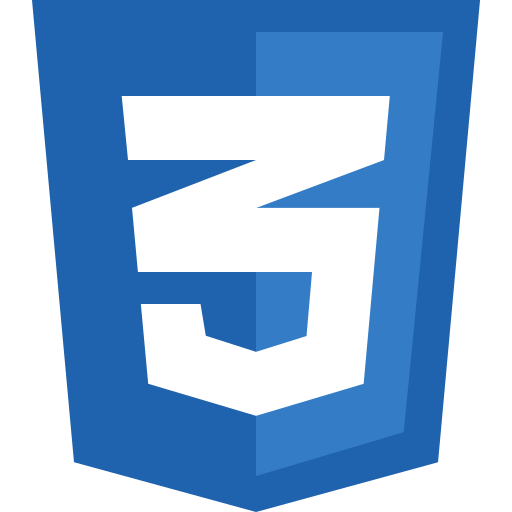

  

<h1 align="center">
  
</h1>

📍I am a versatile Junior Web Developer, passionate about **frontend development** while also exploring **full-stack projects** 🌐. I have experience in **game development, AI-based computer vision, and app development** 📱. With a keen eye for design 🎨, I craft **user-friendly and aesthetic interfaces**. Highly responsible, problem-solving, and goal-oriented, I love bringing ideas to life through code 🛠️.

<h5 align="center">
  <code></code>
  <code></code>
  <code></code>
  <code></code>
</h5>

### 🧐 More About Me:

- 🔭 &nbsp; I’m currently working on **Food Ordering App with React Native**
- 🤝 &nbsp; I’m open to collaborating on **creative web and app  
  development projects**
- 🌱 &nbsp; I’m currently learning **TypeScript, React Native and advanced frontend frameworks**
- 👩🏻‍💻 &nbsp; Most of my projects are available on [GitHub](https://github.com/BeyzaSimsekk?tab=repositories)
- 🎨 &nbsp; I combine **Figma and design tools** to build visually appealing and functional UI/UX
- 📫 &nbsp; Connect with me on [LinkedIn](https://www.linkedin.com/in/ummu-beyza-simsek/)
- 📝 &nbsp; Check out my [resume](https://drive.google.com/file/d/1ryLi4bu3fiSDE9M6og7KviXEyB6dliS0/view?usp=sharing)
- 📚 &nbsp; In my free time, I enjoy **reading, exploring philosophy** and **diving into tech innovations**. Checkout my [1000kitap](https://1000kitap.com/totorodiaries)

<h2 align="center">🚀 Languages & Frameworks & Tools & Abilities 🚀</h2>
 

  <code></code>
  <code></code>
  <code></code>
  <code></code>
  <code></code>
  <code></code>
  <code></code>
  <code></code>
  <code></code>
  <code></code>
  <code></code>
  <code></code>
  <code></code>
  <code></code>
  <code></code>
  <code></code>
  

  

  <code></code>
  <code></code>
  <code></code>
  <code></code>
  <code></code>
  <code></code>
  <code></code>
  <code></code>
  <code></code>
  <code></code>
  <code></code>
  <code></code>
  <code></code>
  <code></code>
  <code></code>
  <code></code>

<h2 align="center">📊 Stats 📊</h2>
 

  

    
    
  

           
  

    
  

   

  

<h2 align="center">💫 Repositories 💫</h2>
 

  

      

  <a align="left" href="https://github.com/KFAU-Academy/KFAUAcademy_GraduationProject" title="KFAU Academy">

      

  

      

  

      

  

<h4 align="center">
  <a href="https://github.com/BeyzaSimsekk?tab=repositories" title="Show Repositories">🔎 Show More 🔍</a>
</h4>

&nbsp;&nbsp;&nbsp;&nbsp;&nbsp;&nbsp;&nbsp;&nbsp;&nbsp;&nbsp;&nbsp;&nbsp;&nbsp;  
